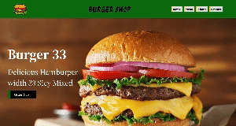

## Burger Shop

📦 Kullanılan Kütüphaneler
react-router-dom: Sayfalar arası yönlendirme (routing) işlemleri için kullanılır. Bu kütüphane, uygulamanın farklı bölümlerine geçiş yaparken kullanıcı deneyimini iyileştirir.

react-icons: Popüler ikon setlerini React projelerinde kolayca kullanmamıza olanak tanır. Kullanıcı arayüzünü zenginleştiren ikonlar sağlar.

Bu projede, react-router-dom ile sayfalar arası geçişler ve react-icons ile görsel zenginleştirme sağlanmıştır.

## Screen Gıf

# Burger-Shop
